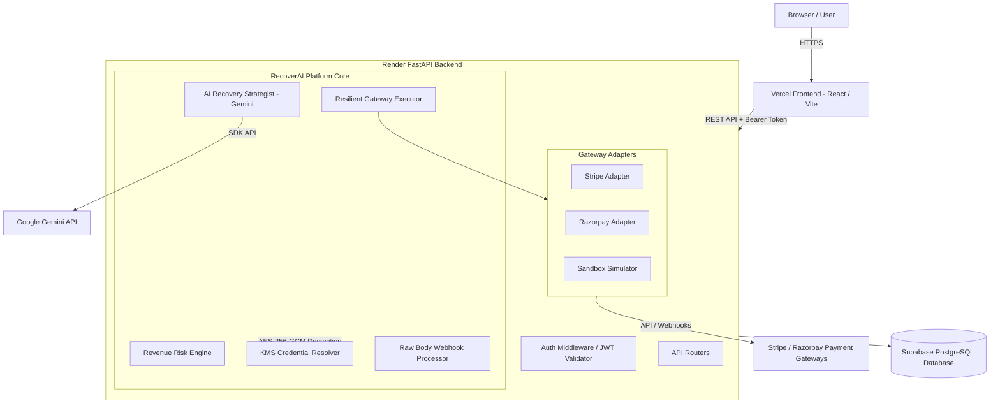

# RecoverAI

> **Autonomous Payment Recovery & Revenue Risk Infrastructure** — An enterprise-grade, multi-tenant payment recovery engine built with FastAPI, React (Vite), Supabase, and Google Gemini AI.

---

## Table of Contents

- [Overview](#overview)
- [Key Features](#key-features)
- [System Architecture](#system-architecture)
- [System Flow & Data Pipeline](#system-flow--data-pipeline)
- [Technology Stack](#technology-stack)
- [Security Architecture](#security-architecture)
- [Gateway Safety & Fallback Engine](#gateway-safety--fallback-engine)
- [Webhook Ingestion & Security](#webhook-ingestion--security)
- [AI & Gemini Integration](#ai--gemini-integration)
- [Frontend Architecture & Dashboard](#frontend-architecture--dashboard)
- [Project Structure](#project-structure)
- [Prerequisites](#prerequisites)
- [Environment Variables](#environment-variables)
- [Database Setup & Migrations](#database-setup--migrations)
- [Local Development Setup](#local-development-setup)
- [Automated Test Suite](#automated-test-suite)
- [Production Deployment](#production-deployment)
- [Troubleshooting Guide](#troubleshooting-guide)
- [Phase & Milestone History](#phase--milestone-history)
- [Security & Secret Handling](#security--secret-handling)
- [Future Work](#future-work)

---

## Overview

**RecoverAI** is an intelligent, multi-tenant payment recovery and revenue risk platform designed to automatically identify, analyze, and recover failed payment transactions for digital merchants.

When recurring payments or single transactions fail due to gateway errors, soft declines, or insufficient funds, traditional retries often cause double charges, customer friction, or merchant credential leaks. RecoverAI provides:

1. **Deterministic Risk Assessment**: Evaluates transaction failure patterns, customer history, and retry velocity to calculate recovery probability and expected recovery value.
2. **AI Recovery Strategist**: Uses Google Gemini AI to analyze failure context and recommend optimal recovery actions with strict safety guardrails.
3. **Resilient Gateway Execution**: Executes payment retries across multiple payment gateways (Stripe, Razorpay, or Sandbox simulator) with state-aware fallback mechanics that **strictly prevent double charging**.
4. **Multi-Tenant Security**: Enforces database Row Level Security (RLS), envelope encryption for merchant API keys, KMS fail-closed behavior, and cryptographic webhook signature verification.

---

## Key Features

- **Multi-Tenant Gateway Credential Encryption**: Implements AES-256-GCM envelope encryption using random per-record Data Encryption Keys (DEKs) wrapped with a Master Key Encryption Key (KEK), preventing plaintext credential leaks in database storage.
- **Fail-Safe Fallback Engine**: State-aware gateway fallback logic that permits failover **only** when a primary attempt is confirmed as `TRANSIENT` and `CONFIRMED_NOT_EXECUTED`. Ambiguous (`UNKNOWN`) states block automatic failover to eliminate double-billing risks.
- **Cryptographic Webhook Verification**: Signature verification for Stripe and Razorpay webhooks reading raw request bytes before JSON parsing, enforcing merchant isolation and replay protection.
- **AI Strategy with Deterministic Safety Guardrails**: Gemini AI model suggestions are validated against a strict policy engine (max retries, max recovery amount, strategy whitelist). Unconfigured or failing AI gracefully falls back to deterministic rule-based decisions.
- **Real-Time Governance & Manual Review Queue**: High-risk or ambiguous payment recovery cases are automatically routed to a manual review queue for human-in-the-loop approval or rejection.
- **Dead-Letter Queue (DLQ) & Observability**: Complete tracking of failed webhook deliveries, retry counts, execution logs, and automated log sanitization (redacting PII, tokens, and authorization headers).

---

## System Architecture



---

## System Flow & Data Pipeline

```
Merchant / Customer Payment Event
       ↓
Webhook / API Ingestion (Raw-body signature verification)
       ↓
Tenant Identification & Bearer / Key Authorization
       ↓
Revenue Risk Engine (Probability & Expected Value Calculation)
       ↓
AI Recovery Strategist (Gemini Evaluation + Policy Guardrail Check)
       ↓
Resilient Gateway Executor
   ├── 1. Resolve & Decrypt Merchant Credentials (AES-256-GCM DEK/KEK)
   ├── 2. Generate Scoped Idempotency Key
   ├── 3. Execute Primary Gateway Attempt (Stripe / Razorpay / Sandbox)
   └── 4. Evaluate Execution State (TRANSIENT + CONFIRMED_NOT_EXECUTED → Fallback; UNKNOWN → Block)
       ↓
Database Persistence (Supabase PostgreSQL with RLS Isolation)
       ↓
Real-Time Dashboard Updates (Vercel React Frontend)
```

---

## Technology Stack

### Backend
- **Framework**: FastAPI (`>=0.110.0`) running on Uvicorn (`>=0.28.0`)
- **Runtime**: Python `3.12+`
- **Database Client**: Supabase Python Client (`>=2.4.0`)
- **AI Integration**: Google GenAI SDK (`google-genai>=2.0.0`)
- **Cryptography**: `cryptography>=42.0.0` (AES-256-GCM envelope encryption)
- **Validation**: Pydantic `v2` (`>=2.6.0`) & `pydantic-settings` (`>=2.2.0`)
- **HTTP Client**: `httpx>=0.27.0`

### Frontend
- **Framework**: React 19 (`react^19.2.8`, `react-dom^19.2.8`)
- **Language**: TypeScript (`~6.0.2`)
- **Build Tool**: Vite (`^8.2.0`)
- **Routing**: `react-router-dom` (`^7.18.2`) with `React.lazy()` and `<Suspense>` route-based code splitting
- **Authentication**: `@supabase/supabase-js` (`^2.112.3`)
- **Data Visualization**: Recharts (`^3.10.1`)
- **Styling**: TailwindCSS (`^3.4.19`) with `clsx` and `tailwind-merge`
- **Icons**: Lucide React (`^1.33.0`)

### Database & Infrastructure
- **Database**: Supabase PostgreSQL with Row Level Security (RLS)
- **Backend Hosting**: Render (FastAPI web service)
- **Frontend Hosting**: Vercel (Vite SPA production build)
- **Version Control**: GitHub

---

## Security Architecture

RecoverAI enforces strict security controls across database, application, and transport layers:

### 1. Multi-Tenant Row Level Security (RLS)
- Every transaction, audit log, merchant setting, and recovery record is bound to a `merchant_id`.
- Supabase RLS policies enforce that authenticated frontend clients can only access data belonging to their own tenant (`auth.uid() = merchant_id`).
- Backend services use tenant-scoped sessions or restricted service-role access where explicitly required.

### 2. Envelope Encryption for Merchant Credentials (AES-256-GCM)
Merchant gateway credentials (Stripe Secret Keys, Razorpay Secrets) are encrypted prior to database storage using a two-tier envelope encryption architecture:

```
Plaintext Secret (e.g. sk_live_...)
       ↓
Generate Random 256-bit Data Encryption Key (DEK)
       ↓
Encrypt Secret via AES-256-GCM (Associated Authenticated Data = merchant_id)
       ↓
Wrap DEK with Master Key Encryption Key (KEK from RECOVERAI_KMS_KEY)
       ↓
Store Record (encrypted_secret, dek_wrapped, iv, dek_iv, tag, dek_tag, key_version)
```

- **AAD Binding**: `merchant_id` is passed as AES-GCM Associated Authenticated Data. Attempting to decrypt a credential under a different merchant ID fails authentication.
- **Key Versioning & Rotation**: Encrypted records track `key_version` (e.g. `v1`).
- **Production Fail-Closed Behavior**: In production mode (`ENVIRONMENT=production`), the application refuses to start or decrypt credentials if `RECOVERAI_KMS_KEY` is set to the default sandbox key or left unconfigured.

### 3. Log & Data Sanitization (`SecretString`)
- All gateway responses, API payloads, and internal log entries are processed through `app.utils.sanitizer.Sanitizer`.
- PII, Credit Card numbers, Authorization Bearer headers, Stripe/Razorpay secret keys, and passwords are automatically redacted before log output or database auditing.

---

## Gateway Safety & Fallback Engine

RecoverAI includes a state-aware gateway execution engine (`app.adapters.resilient_executor.ResilientExecutor`) designed to execute retries safely across multiple payment providers (Stripe, Razorpay, Sandbox).

### Execution States & Error Classifications

| Execution State | Meaning | Fallback Permitted? |
| :--- | :--- | :--- |
| `CONFIRMED_NOT_EXECUTED` | Gateway confirms the transaction was not processed (e.g., connection timeout before gateway submission). | **YES** (if error is `TRANSIENT`) |
| `CONFIRMED_EXECUTED` | Gateway confirmed charge processing was attempted. | **NO** |
| `UNKNOWN` | Network failure occurred during or after HTTP request dispatch; gateway status is ambiguous. | **STRICTLY BLOCKED** |

| Error Classification | Meaning |
| :--- | :--- |
| `TRANSIENT` | Network timeout, rate limit (429), or temporary gateway outage. Eligible for retry if not executed. |
| `PERMANENT` | Invalid card, expired card, fraud block, or hard decline. Fallback is **BLOCKED**. |

> **Critical Double-Charging Rule**:
> Fallback to a secondary gateway is **ONLY** allowed when:
> $$\text{Error} = \text{TRANSIENT} \quad \text{AND} \quad \text{Execution State} = \text{CONFIRMED\_NOT\_EXECUTED}$$
> If a gateway attempt returns `UNKNOWN`, automatic failover is **strictly blocked** to prevent double-charging the customer.

---

## Webhook Ingestion & Security

The webhook router (`app/routers/events.py`) handles incoming event notifications from payment providers:

- **Raw Request Body Reading**: Webhook signatures are validated against `request.body()` raw bytes before any JSON parsing occurs, preventing body manipulation attacks.
- **Provider Signature Verification**:
  - **Stripe**: `v1` HMAC-SHA256 signature verification with tolerance against timestamp drift.
  - **Razorpay**: `X-Razorpay-Signature` HMAC-SHA256 verification against configured webhook secret.
- **Idempotency & Replay Protection**: Incoming event IDs are recorded in `webhook_deliveries`. Duplicate event deliveries return `HTTP 200` with status `already_processed` without triggering duplicate recovery workflows.
- **Authentication Failures**: Invalid signatures return `HTTP 401 Unauthorized`.

---

## AI & Gemini Integration

RecoverAI integrates Google Gemini AI (`google-genai>=2.0.0`) via `app.ai.recovery_strategist.AIRecoveryStrategist`.

- **Model**: `gemini-3-flash-preview` (configurable via `GEMINI_MODEL` environment variable).
- **Purpose**: Evaluates complex transaction failure context (declined code, retry count, customer LTV, historical failure pattern) to produce structured JSON recovery strategies.
- **Policy Controller Guardrails**: Every AI recommendation is validated by `app.ai.policy_controller.PolicyController` against deterministic safety rules:
  - Recovery amount cannot exceed original transaction amount.
  - Strategy must exist in the strategy whitelist.
  - Retry count must not exceed merchant limits.
  - Low-confidence AI outputs are rejected and sent to human review.
- **Offline / Test Fallback**: If `GEMINI_API_KEY` is unconfigured, disabled, or unreachable, the system gracefully falls back to deterministic rule-based recovery decisions without throwing errors. Automated backend tests patch `GEMINI_API_KEY=""` to run completely offline.

---

## Frontend Architecture & Dashboard

The frontend is a single-page application (SPA) built with React 19, TypeScript, and Vite.

### Key Pages & Routes

| Route | Component | Description |
| :--- | :--- | :--- |
| `/login` | `Login.tsx` | Supabase authentication page (email/password). |
| `/` | `Overview.tsx` | Primary executive dashboard with recovery metrics, success rates, and charts. |
| `/revenue-risk` | `RevenueRisk.tsx` | Real-time transaction risk scoring and expected value distribution. |
| `/recovery-opportunities` | `RecoveryOpportunities.tsx` | Active payment recovery opportunities eligible for automated execution. |
| `/transactions` | `Transactions.tsx` | Searchable grid of all payment transactions and gateway logs. |
| `/ai-decisions` | `AIDecisions.tsx` | Audit trail of AI recovery strategist evaluations and guardrail verdicts. |
| `/manual-review` | `ManualReview.tsx` | Human-in-the-loop review queue and Webhook DLQ management. |
| `/analytics` | `Analytics.tsx` | Deep-dive performance analytics and continuous evaluator metrics. |
| `/audit-logs` | `AuditLogs.tsx` | Immutable system audit logs for administrative compliance. |
| `/settings` | `Settings.tsx` | Merchant settings, autonomous mode toggle, and webhook key management. |
| `/help` | `Help.tsx` | Platform documentation and usage guidelines. |

### API Configuration
The API client (`frontend/src/lib/api.ts`) resolves the backend base URL via `VITE_API_URL`:
```typescript
const API_BASE =
  import.meta.env.VITE_API_URL ||
  (import.meta.env.PROD
    ? 'https://recoverai-6gwv.onrender.com'
    : 'http://localhost:8000');
```
- In local development (`npm run dev`), if `VITE_API_URL` is omitted, it defaults to `http://localhost:8000`.
- In production builds (`npm run build`), if `VITE_API_URL` is omitted, it automatically falls back to `https://recoverai-6gwv.onrender.com`.

---

## Project Structure

```
RecoverAI/
├── backend/
│   ├── app/
│   │   ├── adapters/
│   │   │   ├── base.py                   # Base gateway adapter interface
│   │   │   ├── factory.py                # Gateway adapter factory
│   │   │   ├── razorpay_adapter.py       # Razorpay API adapter & signature validation
│   │   │   ├── resilient_executor.py     # State-aware failover execution engine
│   │   │   ├── sandbox.py                # Sandbox simulator gateway adapter
│   │   │   └── stripe_adapter.py         # Stripe API adapter & signature validation
│   │   ├── ai/
│   │   │   ├── context_builder.py        # Context aggregation for Gemini prompts
│   │   │   ├── decision_validator.py     # AI output validation against JSON schema
│   │   │   ├── evaluator.py              # Continuous accuracy & performance evaluator
│   │   │   ├── policy_controller.py      # Deterministic safety rule guardrails
│   │   │   ├── recovery_strategist.py    # Gemini GenAI SDK integration & strategy logic
│   │   │   └── schemas.py                # Pydantic schemas for AI inputs/outputs
│   │   ├── auth/
│   │   │   └── deps.py                   # Supabase JWT & tenant resolution dependencies
│   │   ├── engine/
│   │   │   ├── dataset_generator.py      # Synthetic dataset generation & splits
│   │   │   ├── db_seeder.py              # Supabase database seeder
│   │   │   ├── evaluator.py              # Metrics calculation (MAE, RMSE, ROC-AUC)
│   │   │   └── risk_engine.py            # Revenue risk scoring & EV engine
│   │   ├── recovery/
│   │   │   ├── simulator.py              # Recovery simulation engine
│   │   │   └── state_machine.py          # Recovery opportunity state transition machine
│   │   ├── routers/
│   │   │   ├── ai.py                     # AI strategy trigger endpoints
│   │   │   ├── ai_decisions.py           # AI decision log endpoints
│   │   │   ├── analytics.py              # Analytics & KPI endpoints
│   │   │   ├── audit_logs.py             # System audit log endpoints
│   │   │   ├── evaluation.py             # Benchmark & evaluation endpoints
│   │   │   ├── events.py                 # Ingestion & raw-body webhook endpoints
│   │   │   ├── manual_review.py          # Human-in-the-loop governance endpoints
│   │   │   ├── merchant_settings.py      # Merchant configuration endpoints
│   │   │   ├── recovery.py               # Recovery execution endpoints
│   │   │   ├── recovery_opportunities.py # Opportunity query endpoints
│   │   │   ├── revenue_risk.py           # Risk assessment endpoints
│   │   │   ├── transactions.py           # Transaction query endpoints
│   │   │   └── webhook_deliveries.py     # Webhook delivery & DLQ management endpoints
│   │   ├── services/
│   │   │   ├── credential_resolver.py    # AES-256-GCM envelope encryption & KMS resolver
│   │   │   └── recovery_pipeline.py      # End-to-end recovery pipeline orchestrator
│   │   ├── utils/
│   │   │   └── sanitizer.py              # PII and token log sanitizer
│   │   ├── config.py                     # Application configuration & fail-closed logic
│   │   ├── db.py                         # Supabase database client initialization
│   │   └── main.py                       # FastAPI application entrypoint & CORS middleware
│   ├── migrations/
│   │   ├── V5__manual_review_and_governance.sql
│   │   ├── V6__authentication_and_full_rls.sql
│   │   ├── V8__merchant_settings_dlq_and_webhook_logs.sql
│   │   ├── V8_1__add_default_gateway_to_merchant_settings.sql
│   │   ├── V8_2__security_hardening_and_indexes.sql
│   │   └── V9__encrypted_merchant_credentials.sql
│   ├── scripts/
│   │   ├── migrate_merchant_credentials.py # Legacy plaintext to V9 AES-256-GCM migration
│   │   ├── run_full_phase3_evaluation.py   # Full benchmark evaluation script
│   │   ├── run_phase2_generation.py        # Dataset generation script
│   │   └── test_endpoints.py               # Endpoint verification script
│   ├── tests/
│   │   ├── run_tests.py                    # Master backend test suite runner
│   │   ├── test_phase2_engine.py
│   │   ├── test_phase3_safety.py
│   │   ├── test_phase7_ingestion.py
│   │   ├── test_phase8_resilience.py
│   │   ├── test_phase8b2_observability.py
│   │   ├── test_phase8b3_gateway_fallback.py
│   │   ├── test_phase9_gateway_adapters.py
│   │   ├── test_phase92_gemini.py
│   │   ├── test_phase93_sandbox_validation.py
│   │   ├── test_phase95_credential_security.py
│   │   └── test_prompt_injection.py
│   └── requirements.txt
├── docs/
│   ├── PHASE_2.md
│   ├── PHASE_4.md
│   └── PHASE_5.md
├── frontend/
│   ├── src/
│   │   ├── components/
│   │   │   ├── common/                  # Reusable UI components (Button, Modal, Card, etc.)
│   │   │   ├── layouts/                 # Application shell & sidebar layout
│   │   │   ├── DLQStatusBadge.tsx
│   │   │   └── WebhookDeliveryTable.tsx
│   │   ├── context/
│   │   │   └── AuthContext.tsx          # Supabase auth context provider
│   │   ├── lib/
│   │   │   ├── api.ts                   # Typed API client with environment resolution
│   │   │   └── supabase.ts              # Supabase browser client
│   │   ├── pages/                       # Dashboard page components
│   │   ├── types/                       # TypeScript interface definitions
│   │   ├── App.tsx                      # Root application router with lazy splitting
│   │   └── main.tsx                     # React DOM entrypoint
│   ├── .env.example
│   ├── package.json
│   ├── tailwind.config.js
│   ├── tsconfig.json
│   └── vite.config.ts                   # Vite configuration with chunk splitting & proxy
└── README.md
```

---

## Prerequisites

- **Python**: `3.12` or higher
- **Node.js**: `v18.0.0` or higher (`npm v9+`)
- **Supabase**: Active Supabase project (PostgreSQL with RLS)
- **Google Gemini API**: Valid Gemini API key (optional for local dev; deterministic fallback used if missing)

---

## Environment Variables

### Backend Variables (`backend/.env`)

| Variable | Required | Default / Fallback | Purpose |
| :--- | :---: | :--- | :--- |
| `ENVIRONMENT` | No | `development` | Runtime mode (`development`, `production`). |
| `VITE_SUPABASE_URL` | Yes | `https://ebivvhhjbnstzgszjqza.supabase.co` | Supabase project endpoint URL. |
| `VITE_SUPABASE_ANON_KEY` | Yes | `<default-anon-key>` | Supabase anonymous public API key. |
| `SUPABASE_SERVICE_ROLE_KEY` | No | `""` | Supabase service-role key for administrative operations. |
| `GEMINI_API_KEY` | No | `""` | Google Gemini API key for AI Strategist. |
| `GEMINI_MODEL` | No | `gemini-3-flash-preview` | Gemini GenAI model identifier. |
| `WEBHOOK_SECRET` | No | `recoverai_webhook_secret_key_2026` | Webhook verification signing secret. |
| `RECOVERAI_KMS_KEY` | **Prod** | `recoverai_master_kms_key...` | 32-byte master KMS key for AES-256-GCM DEK wrapping. **Must be explicitly set in production**. |
| `CORS_ALLOWED_ORIGINS` | **Prod** | `""` (Local dev defaults) | Comma-separated list of allowed CORS origins (e.g. `https://recoverai-henna.vercel.app`). **Must be set in production**. |

### Frontend Variables (`frontend/.env`)

| Variable | Required | Default / Fallback | Purpose |
| :--- | :---: | :--- | :--- |
| `VITE_SUPABASE_URL` | Yes | `<supabase-url>` | Supabase project URL for browser client. |
| `VITE_SUPABASE_ANON_KEY` | Yes | `<supabase-anon-key>` | Supabase anonymous key for auth. |
| `VITE_API_URL` | No | `http://localhost:8000` | Base URL of backend FastAPI service (e.g. `https://recoverai-6gwv.onrender.com`). |

---

## Database Setup & Migrations

Database schema and security migrations are located under `backend/migrations/`:

1. `V5__manual_review_and_governance.sql`: Creates manual review queue tables, audit logs, and approval governance workflows.
2. `V6__authentication_and_full_rls.sql`: Configures Supabase authentication integration, tenant schema binding, and Row Level Security policies.
3. `V8__merchant_settings_dlq_and_webhook_logs.sql`: Adds merchant settings, webhook delivery logs, and Dead-Letter Queue (DLQ) tracking.
4. `V8_1__add_default_gateway_to_merchant_settings.sql`: Adds primary default gateway configuration per merchant.
5. `V8_2__security_hardening_and_indexes.sql`: Adds performance indexes on `merchant_id`, `created_at`, and `status` fields.
6. `V9__encrypted_merchant_credentials.sql`: Updates `merchant_credentials` table with AES-256-GCM envelope encryption fields (`encrypted_secret`, `dek_wrapped`, `iv`, `tag`, `key_version`).

### Legacy Credential Migration Script
To migrate legacy unencrypted or single-key merchant credentials to the V9 AES-256-GCM envelope format:
```bash
python backend/scripts/migrate_merchant_credentials.py
```
> *Note: This is an explicit administrative utility script and does not run automatically during application startup.*

---

## Local Development Setup

### 1. Clone Repository
```bash
git clone https://github.com/your-org/RecoverAI.git
cd RecoverAI
```

### 2. Backend Setup
```bash
# Create and activate Python virtual environment
python -m venv venv
# On Windows:
venv\Scripts\activate
# On Linux/macOS:
source venv/bin/activate

# Install dependencies
pip install -r backend/requirements.txt

# Configure local backend environment
cp backend/.env.example backend/.env # (or create backend/.env)

# Run FastAPI development server
uvicorn app.main:app --app-dir backend --reload --port 8000
```
Backend will start at: `http://localhost:8000` (Health check: `http://localhost:8000/health`).

### 3. Frontend Setup
```bash
cd frontend

# Install Node dependencies
npm install

# Run Vite development server
npm run dev
```
Frontend will start at: `http://localhost:3000` (or `http://localhost:5173`).

---

## Automated Test Suite

RecoverAI features a comprehensive master test suite covering risk engines, AI safety guardrails, webhook ingestion, gateway resilience, and credential security.

To run the complete backend test suite:
```bash
python backend/tests/run_tests.py
```

### Verified Test Suite Summary

```
--- RUNNING PHASE 2.5 DECOUPLED ENGINE AUTOMATED TEST SUITE ---
[PASS] 10/10 Dataset Generation, Risk Engine, & Evaluator Tests

--- RUNNING PHASE 3 SAFETY TEST SUITE ---
[PASS] 12/12 AI Safety & Policy Guardrail Tests

--- RUNNING PHASE 7 INGESTION TEST SUITE ---
[PASS] Webhook Ingestion & Signature Verification Tests

--- RUNNING PHASE 8 RESILIENCE TEST SUITE ---
[PASS] Sandbox Adapter Execution & Resilient Factory Tests

--- RUNNING PHASE 8B.2 OBSERVABILITY TEST SUITE ---
[PASS] PII, Token, & Header Log Sanitization Tests

--- RUNNING PHASE 8B.3 GATEWAY FALLBACK TEST SUITE ---
[PASS] Resilient Fallback, UNKNOWN State Blocking, & Idempotency Tests

--- RUNNING PHASE 9.1 PRODUCTION GATEWAY ADAPTERS TEST SUITE ---
[PASS] 11/11 Stripe & Razorpay Adapter Verification Tests

--- RUNNING PHASE 9.2 GEMINI SDK MIGRATION TEST SUITE ---
[PASS] 3/3 Gemini GenAI Client & Offline Fallback Tests

--- RUNNING PHASE 9.3 SANDBOX GATEWAY VALIDATION TEST SUITE ---
[PASS] Gateway Validation & Webhook Security Suite

--- RUNNING PHASE 9.5 MULTI-TENANT CREDENTIAL SECURITY TEST SUITE ---
[PASS] AES-256-GCM Envelope Encryption & AAD Isolation Tests

ALL BACKEND AUTOMATED TESTS PASSED SUCCESSFULLY!
```

To test the frontend production build:
```bash
cd frontend
npm run build
```

---

## Production Deployment

The RecoverAI production stack is deployed across Render (Backend), Vercel (Frontend), and Supabase (Database):

```
GitHub Repository
   ├── Render Backend (FastAPI Web Service)
   ├── Vercel Frontend (Vite React SPA)
   └── Supabase Database (PostgreSQL + RLS)
```

### 1. Backend Deployment (Render)
- **Platform**: Render Web Service
- **Root Directory**: `backend`
- **Build Command**: `pip install -r requirements.txt`
- **Start Command**: `uvicorn app.main:app --host 0.0.0.0 --port $PORT`
- **Health Check Path**: `/health`
- **Required Environment Variables**:
  - `ENVIRONMENT=production`
  - `RECOVERAI_KMS_KEY=<secure-32byte-master-key>`
  - `CORS_ALLOWED_ORIGINS=https://recoverai-henna.vercel.app`
  - `VITE_SUPABASE_URL=https://ebivvhhjbnstzgszjqza.supabase.co`
  - `VITE_SUPABASE_ANON_KEY=<supabase-anon-key>`
  - `SUPABASE_SERVICE_ROLE_KEY=<supabase-service-role-key>`
  - `GEMINI_API_KEY=<gemini-api-key>`

### 2. Frontend Deployment (Vercel)
- **Platform**: Vercel
- **Root Directory**: `frontend`
- **Framework Preset**: `Vite`
- **Build Command**: `npm run build`
- **Output Directory**: `dist`
- **Required Environment Variables**:
  - `VITE_SUPABASE_URL=https://ebivvhhjbnstzgszjqza.supabase.co`
  - `VITE_SUPABASE_ANON_KEY=<supabase-anon-key>`
  - `VITE_API_URL=https://recoverai-6gwv.onrender.com`

### Live Production Endpoints

- **Frontend Application**: [https://recoverai-henna.vercel.app](https://recoverai-henna.vercel.app)
- **Backend Service**: [https://recoverai-6gwv.onrender.com](https://recoverai-6gwv.onrender.com)
- **Health Check Endpoint**: [https://recoverai-6gwv.onrender.com/health](https://recoverai-6gwv.onrender.com/health)

---

## Troubleshooting Guide

### 1. "Failed to fetch" / CORS Errors in Browser
- **Cause**: Backend CORS origin list does not include the frontend URL.
- **Solution**: Ensure `CORS_ALLOWED_ORIGINS` on Render is set to exact frontend origin (e.g. `https://recoverai-henna.vercel.app`) without trailing slashes.

### 2. Production Vercel Frontend Still Requests `localhost:8000`
- **Cause**: `VITE_API_URL` environment variable was missing during the Vercel build phase, or cached.
- **Solution**: Set `VITE_API_URL=https://recoverai-6gwv.onrender.com` in Vercel project environment variables and trigger a **Redeploy** (Clear Cache).

### 3. Backend Fails to Start on Render (`RuntimeError: Production Fail-Closed Violation`)
- **Cause**: Running in `production` mode with missing or default `RECOVERAI_KMS_KEY` or `CORS_ALLOWED_ORIGINS`.
- **Solution**: Configure a custom 32-byte secret string for `RECOVERAI_KMS_KEY` and explicit `CORS_ALLOWED_ORIGINS` on Render.

### 4. Webhook Ingestion Returns `401 Unauthorized`
- **Cause**: Webhook signature header is missing or does not match configured `WEBHOOK_SECRET` / merchant key.
- **Solution**: Verify gateway webhook endpoint secrets in payment provider settings match `WEBHOOK_SECRET` or decrypted merchant settings.

### 5. Gemini AI Decisions Fall Back to Rule-Based Mode
- **Cause**: `GEMINI_API_KEY` is not provided or API quota exceeded.
- **Solution**: Provide a valid Gemini API key in `GEMINI_API_KEY`. (Note: The engine will continue functioning safely via deterministic fallback rules even if Gemini is offline).

---

## Phase & Milestone History

| Milestone / Phase | Git Commit Hash | Core Achievements & Delivery Scope |
| :--- | :---: | :--- |
| **Phase 1** | `4c4cd4c`, `6b78f6b` | RecoverAI platform initialization & core API foundation. |
| **Phase 2** | `641a3f8` | Revenue Risk Engine & continuous evaluation framework. |
| **Phase 3 & 4**| `8eae5e2` | AI Strategist policy guardrails & live dashboard integration. |
| **Phase 5** | `a61b18b` | Manual review governance queue & approval workflows. |
| **Phase 6** | `32a329c` | Supabase authentication & multi-tenant isolation. |
| **Phase 7** | `faa69f3` | Raw-body webhook ingestion security & signature verification. |
| **Phase 8A** | `e3822a2`, `eebb504` | Production resilience & error recovery pipeline. |
| **Phase 8B.1** | `db7d100` | Database security hardening & performance indexing. |
| **Phase 8B.2** | `741a0e3` | Observability logging, PII sanitization, & Webhook DLQ UI. |
| **Phase 8B.3** | `253d7bd` | Resilient gateway fallback & state-aware UNKNOWN blocking. |
| **Phase 9.1** | `b7506fd` | Stripe & Razorpay gateway adapter integration. |
| **Phase 9.2** | `e6c9ff2` | Google GenAI SDK migration (`google-genai`) & frontend optimization. |
| **Phase 9.3** | `910d321` | Sandbox gateway validation & provider signature checks. |
| **Phase 9.4** | *(Read-Only Audit)* | Production readiness security & architecture audit gate. |
| **Phase 9.5** | `a14595e` | Multi-tenant AES-256-GCM envelope credential encryption & KMS fail-closed validation. |
| **Phase 10** | `47409fa`, `84d406d` | Production deployment preparation & Vercel API URL configuration. |

---

## Security & Secret Handling

> [!CAUTION]
> **CRITICAL SECURITY REQUIREMENT**
>
> NEVER commit production secrets, private keys, or API credentials to Git repositories.
>
> Verify `.gitignore` rules before pushing:
> - Do NOT commit `.env`, `.env.local`, or `backend/.env` files.
> - Do NOT commit `RECOVERAI_KMS_KEY` master key strings.
> - Do NOT commit `GEMINI_API_KEY`, `SUPABASE_SERVICE_ROLE_KEY`, or live gateway secrets.
>
> Production secrets must ONLY be injected via Render, Vercel, and Supabase Environment Variable configuration panels.

---

## Future Work

- **Additional Gateway Adapters**: Integration of Adyen and PayPal payment gateway adapters into the `ResilientExecutor` factory.
- **Automated KMS Key Rotation**: Automated background job for re-wrapping DEKs during KEK key rotation.
- **Real-Time Event Streaming**: WebSockets or Server-Sent Events (SSE) for live dashboard risk notifications.

---

## License

This codebase is proprietary and confidential software developed for the **RecoverAI** enterprise payment recovery platform. All rights reserved.
